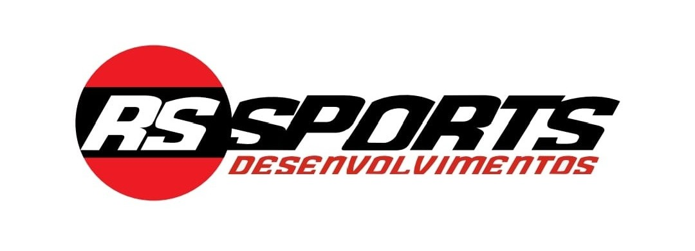

  

# RSSports Team — Engenharia & Performance

Site institucional da **RSSports Team**, equipe brasileira de automobilismo focada em **performance real em pista, endurance e engenharia aplicada**.

O projeto apresenta a identidade visual da equipe, sua história, storytelling do fundador, galeria de competições e posicionamento institucional da marca.

---

## 🏎️ Sobre a RSSports

A **RSSports Team** nasceu da paixão pelo automobilismo e da busca constante por performance competitiva.  
Fundada por **Rodrigo Sucata**, a equipe construiu sua trajetória dentro do ambiente de pista, unindo experiência prática, mentalidade de corrida e engenharia aplicada.

Com base no **Autódromo de Tarumã (RS)**, a RSSports desenvolve projetos próprios, prepara carros de competição e atua em provas de longa duração e velocidade nacional, sempre com foco em:

> preparação extrema, decisões estratégicas e confiabilidade mecânica.

---

## 🚀 Tecnologias utilizadas

- React
- Vite
- Tailwind CSS
- Framer Motion
- Lucide Icons

---

## 📦 Instalação local

Pré-requisitos:
- Node.js 18+
